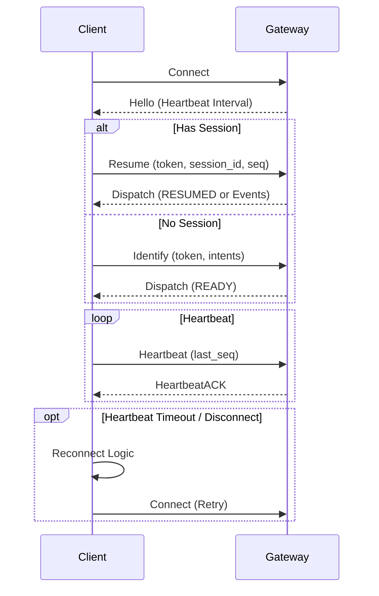

<div align="center">


</div>

# QQ Bot

This is a Rust implementation of a QQ Bot using the official open API.

## Project Structure

The project has been refactored for better modularity and maintainability:

```
src/
├── lib.rs          # Library root, exports modules
├── main.rs         # Application entry point
├── config.rs       # Configuration management (Env vars)
├── models/         # Data models
│   ├── auth.rs     # Authentication models
│   ├── event.rs    # Event models (QQBotEvent, OpCode)
│   └── message.rs  # Message models (GroupMessage, PostMessageBody)
├── services/       # Core business logic
│   ├── client.rs   # QQ API Client
│   ├── server.rs   # WebHook / WebSocket Server
│   └── websocket/  # WebSocket Client Module
│       ├── connection.rs # Connection management, Heartbeat, Resume
│       ├── state.rs      # Session state management
│       └── error.rs      # WebSocket errors
└── utils/          # Utilities
    └── validation.rs # WebHook signature validation
```

## WebSocket Client

The WebSocket module (`src/services/websocket`) implements a robust client for the QQ Bot Gateway.

### Features

- **Automatic Reconnection**: Automatically reconnects on connection loss or heartbeat timeout.
- **Session Resume**: Supports resuming sessions (OpCode 6) to avoid missing events.
- **Heartbeat Mechanism**: Sends periodic heartbeats and detects timeouts.
- **Jittered Backoff**: Randomize reconnection delays to prevent thundering herd.

### Connection Lifecycle



### Configuration

The application uses `dotenv` to load configuration from a `.env` file or environment variables.

Supported variables:
- `QQ_APP_ID`: App ID
- `QQ_CLIENT_SECRET`: Client Secret

## Build and Run

1. Build:
   ```bash
   cargo build
   ```

2. Run:
   ```bash
   cargo run
   ```

3. Test:
   ```bash
   cargo test
   ```
